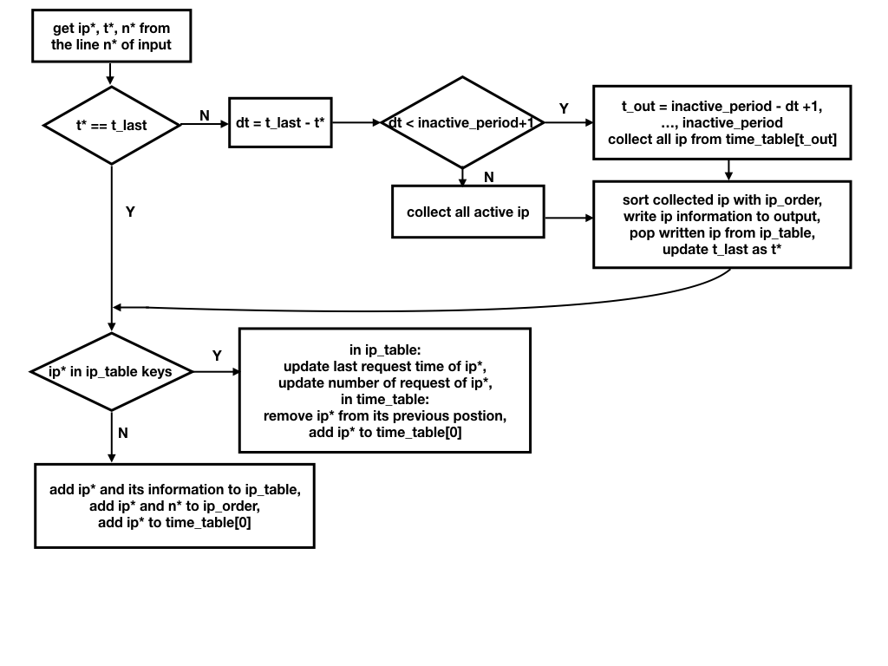

# Table of Contents
1. [Running Instructions](README.md#running-instructions)
2. [Data Structures](README.md#data-structures)
3. [Algorithm](README.md#algorithm)

# Running Instructions

The code is written in `Python 2.7.13`.

The code requires the built-in Python package of `datetime`.

# Data Structure

The code uses the following data structures to solve the problem.

* `t_last`: a datetime object that stores the time of the last request

* `ip_table`: a dictionary that stores information (first request time, last request itime, number of request) of currently active ip
> {ip(1):[ft(1), lt(1), n(1)], ...}

* `ip_order`: a dictionary that stores the order of an ip's first request for that session appeared in the input file
> {ip(1): order(1), ...}

* `time_table`: a dictionary that stores the active time in seconds (from 0 to inactive period) of all active ip
> {0: [ip(1), ...], ...}

# Algorithm

The code reads input from line and line and follow the below logistics.

The code finishes reading input and writes all remaining requests to output.